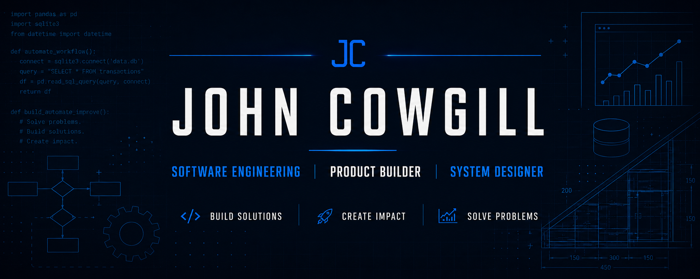

  

# Hi, I'm John Cowgill 👋

## Software Engineer • Product Builder • Systems Designer

I spent **17 years in accounting** designing and building automation solutions that eliminated repetitive manual work, standardized financial processes, and improved reporting efficiency.

Today I'm expanding those skills into **software engineering, UX/UI design, AI, and product development** while building finance automation tools, business applications, and simulation games.

My passion is building software that saves people time, solves meaningful problems, and occasionally brings people joy.

---

  
  
  
  

  
  
  
  

## 🚀 Areas of Focus

| Professional | Creative |
|--------------|----------|
| 💼 Finance Automation | 🎮 Simulation Games |
| 📊 Financial Reporting | 🕹️ Game Development |
| ⚙️ Workflow Automation | 🧠 Systems Design |
| 🖥️ Desktop Applications | 🎲 Economy Design |

---

## 🛠️ Technical Skills

### Languages & Technologies

* Python
* SQL
* Microsoft Excel
* Git & GitHub
* Tkinter
* Workflow Automation
* Financial Reporting

---

## 🗺️ Learning Journey

| Status | Milestone |
|--------|-----------|
| ✅ | Professional Portfolio |
| 🔄 | Google Data Analytics Professional Certificate |
| ⏳ | Software Engineering |
| ⏳ | Google UX Design Professional Certificate |
| ⏳ | Artificial Intelligence |
| ⏳ | Game Development |

---

## 📊 GitHub Activity

---

## ⭐ Featured Projects

### 📄 Automated Invoice Processing

Automated extraction of vendor PDF invoices into standardized, upload-ready accounting files.

**Highlights**

* PDF Data Extraction
* Python Automation
* Excel Generation
* Accounts Payable Workflow

---

### 💰 Automated Payroll Reporting

End-to-end payroll reporting automation supporting multiple legal entities and business groups.

**Highlights**

* Multi-Entity Reporting
* Desktop GUI
* Automated Validation
* Financial Reporting

---

### 📊 Automated Financial Reporting

Automated financial statement generation using SQL, Python, and Excel.

**Highlights**

* SQL Reporting Pipeline
* PTD / YTD Reporting
* Consolidated Financial Statements
* Workflow Automation

---

## 🌱 Current Focus

Project Phoenix is my long-term roadmap to becoming a well-rounded **Product Builder** by combining:

* Software Engineering
* Finance Domain Expertise
* UX/UI Design
* AI
* Game Development

Rather than simply writing code, my goal is to build products that people genuinely enjoy using.

---

## 🎯 Guiding Principles

Every project I build should answer **YES** to these five questions:

1. Does it solve a real problem?
2. Is it technically well engineered?
3. Is it intuitive enough that someone can use it without a manual?
4. Does it look polished and trustworthy?
5. Would I be proud to put my name on it?

---

## 🧪 Currently Building

* Professional Finance Automation Portfolio
* Software Engineering Skills
* Game Development Skills
* Simulation Game Prototypes

---

## 🎯 The Project Phoenix Standard

Before I consider a project complete, it should answer **YES** to all five questions.

| ✔ | Question |
|---|----------|
| ✅ | Does it solve a real problem? |
| ✅ | Is it technically well engineered? |
| ✅ | Is it intuitive enough that someone can use it without a manual? |
| ✅ | Does it look polished and trustworthy? |
| ✅ | Would I be proud to put my name on it? |

---

## Project Phoenix

My long-term goal is to become a Product Builder by combining

• Software Engineering
• Finance Expertise
• UX/UI Design
• AI
• Game Development

To build software that saves people time, solves meaningful problems, and occasionally brings people joy.

## 📫 Let's Connect

I'm always interested in discussing:

* Finance Automation
* Python Development
* SQL
* Software Engineering
* Product Development
* Simulation Games
* Workflow Automation

---

> **"Build software that saves people time, solves meaningful problems, and occasionally brings people joy."**
>
> — Project Phoenix
